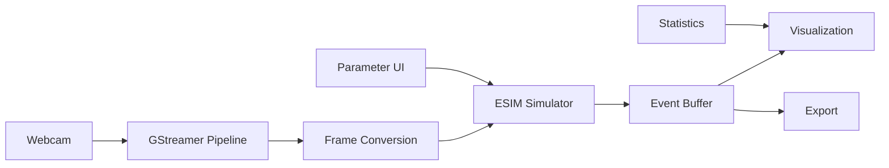

# Webcam Event Simulation Demo - Technical Implementation Plan

## Overview
Create a complete, usable demo that captures live webcam video and converts it to event data in real-time, building on evlib's existing GStreamer integration and ESIM simulation capabilities.

## Analysis of Current Capabilities

### ✅ **Existing Components**
1. **GStreamer Video Processing** (`src/ev_simulation/gstreamer_video.rs`)
   - Complete webcam capture pipeline (cross-platform: Linux/macOS/Windows)
   - Frame conversion to Candle tensors with grayscale conversion
   - Real-time streaming support with configurable resolution

2. **ESIM Event Simulation** (`src/ev_simulation/mod.rs`)
   - Full ESIM implementation with configurable contrast thresholds
   - Noise models (shot noise, dark current, pixel mismatch)
   - Refractory period simulation
   - Per-pixel state tracking with intensity buffers

3. **Python Bindings** (`src/ev_simulation/python.rs`)
   - PyO3 integration for Python access
   - Configuration structures exposed to Python

### 🔧 **Required Enhancements**

## Phase 1: Core Integration (1-2 hours)

### 1.1 Real-time Event Stream Pipeline
**File**: `src/ev_simulation/realtime_stream.rs`

```rust
pub struct RealtimeEventStream {
    video_capture: VideoCapture,
    event_simulator: EventSimulator,
    event_buffer: Arc<Mutex<Vec<Event>>>,
    is_running: bool,
    frame_rate: f64,
}

impl RealtimeEventStream {
    pub fn new(config: SimulationConfig) -> CandleResult<Self>
    pub fn start_webcam_stream(&mut self, device_id: u32) -> CandleResult<()>
    pub fn get_latest_events(&mut self, max_events: usize) -> Vec<Event>
    pub fn stop_stream(&mut self) -> CandleResult<()>
    pub fn get_statistics(&self) -> StreamingStats
}
```

**Key Features**:
- Asynchronous frame capture and event generation
- Thread-safe event buffer for real-time access
- Configurable frame rate and buffer size
- Performance monitoring (events/second, frame rate)

### 1.2 Enhanced Python API
**File**: `src/ev_simulation/python.rs` (additions)

```python
# New Python API for real-time streaming
class RealtimeEventStream:
    def __init__(self, config: dict)
    def start_webcam(self, device_id: int = 0) -> None
    def get_events(self, max_events: int = 10000) -> dict
    def stop(self) -> None
    def get_stats(self) -> dict
    def list_cameras(self) -> List[str]
```

## Phase 2: Interactive Demo Application (2-3 hours)

### 2.1 Python Demo Script
**File**: `examples/webcam_event_demo_interactive.py`

```python
"""
Interactive Webcam Event Simulation Demo

Features:
- Live webcam preview with event overlay
- Real-time parameter adjustment (thresholds, noise)
- Event statistics and visualization
- Save/export functionality
"""

import matplotlib.pyplot as plt
import matplotlib.animation as animation
from matplotlib.widgets import Slider, Button
import numpy as np
import evlib

class InteractiveEventDemo:
    def __init__(self):
        self.event_stream = None
        self.fig = None
        self.setup_gui()

    def setup_gui(self):
        # Create multi-panel interface:
        # - Panel 1: Live video feed
        # - Panel 2: Event visualization (scatter plot)
        # - Panel 3: Event rate over time
        # - Panel 4: Parameter controls (sliders)
        pass

    def start_capture(self):
        # Initialize webcam capture
        # Start real-time event generation
        pass

    def update_visualization(self, frame):
        # Update all plots with latest events
        # Display performance metrics
        pass
```

### 2.2 Jupyter Notebook Demo
**File**: `examples/webcam_event_simulation_live.ipynb`

- Interactive widgets for parameter control
- Real-time plots of event data
- Educational explanations of ESIM principles
- Export capabilities (H5, NPZ, video)

## Phase 3: Advanced Features (2-3 hours)

### 3.1 Event Data Export and Visualization
**File**: `src/ev_simulation/export.rs`

```rust
pub struct EventDataExporter {
    format: ExportFormat,
    buffer: Vec<Event>,
}

pub enum ExportFormat {
    H5,
    NPZ,
    Text,
    Video, // Reconstructed from events
}

impl EventDataExporter {
    pub fn export_to_file(&self, events: &[Event], path: &Path) -> Result<()>
    pub fn create_event_video(&self, events: &[Event], config: VideoConfig) -> Result<Vec<u8>>
}
```

### 3.2 Web Interface (Optional)
**File**: `examples/webcam_event_web_demo.py`

- Streamlit-based web interface
- Browser-accessible event simulation
- Social sharing of event data
- Inspired by rpg_vid2e web app

## Phase 4: Performance Optimization and Testing (1-2 hours)

### 4.1 Performance Benchmarking
**File**: `tests/test_realtime_performance.rs`

```rust
#[cfg(test)]
mod performance_tests {
    #[test]
    fn test_30fps_realtime_performance() {
        // Verify 640x480@30fps can be processed in real-time
        // Target: <33ms per frame processing time
    }

    #[test]
    fn test_event_throughput() {
        // Measure events/second throughput
        // Target: >100k events/second processing
    }

    #[test]
    fn test_memory_usage() {
        // Monitor memory usage during long captures
        // Ensure no memory leaks
    }
}
```

### 4.2 Integration Tests
**File**: `tests/test_webcam_integration.rs`

```rust
#[cfg(test)]
mod integration_tests {
    #[test]
    fn test_webcam_to_events_pipeline() {
        // End-to-end test with mock webcam data
    }

    #[test]
    fn test_parameter_adjustment() {
        // Test real-time parameter changes
    }

    #[test]
    fn test_export_formats() {
        // Verify all export formats work correctly
    }
}
```

## Technical Implementation Details

### Key Architecture Decisions

1. **Threading Model**:
   - Main thread: GUI/visualization
   - Capture thread: GStreamer frame acquisition
   - Processing thread: Event simulation
   - Export thread: File I/O operations

2. **Memory Management**:
   - Circular buffer for event storage (configurable size)
   - Lazy frame processing to maintain real-time performance
   - Automatic garbage collection of old events

3. **Configuration Management**:
   - Hot-swappable parameters (thresholds, noise levels)
   - Preset configurations (indoor, outdoor, high-speed)
   - User preference persistence

### Performance Targets

| Metric | Target | Rationale |
|--------|--------|-----------|
| Frame Rate | 30 FPS | Standard webcam rate |
| Resolution | 640x480 | Balance of quality vs performance |
| Event Throughput | >100k events/sec | Handle high-activity scenes |
| Latency | <100ms | Real-time feel |
| Memory Usage | <500MB | Reasonable for laptop/desktop |

### Cross-Platform Considerations

| Platform | Video Source | Notes |
|----------|--------------|-------|
| Linux | v4l2src | Standard Video4Linux |
| macOS | avfvideosrc | AVFoundation integration |
| Windows | ksvideosrc | DirectShow/WinRT |

### Data Flow Diagram



## Implementation Priority

### MVP (Minimum Viable Product)
1. ✅ Basic webcam capture working
2. ✅ Real-time event generation
3. ✅ Simple visualization (scatter plot)
4. ✅ Parameter adjustment (contrast thresholds)

### Enhanced Features
1. 🔧 Multi-panel interactive GUI
2. 🔧 Performance monitoring
3. 🔧 Export functionality
4. 🔧 Preset configurations

### Advanced Features
1. 🚀 Web interface
2. 🚀 Video reconstruction from events
3. 🚀 Multi-camera support
4. 🚀 Real-time filtering/processing

## Verification and Testing Strategy

### Unit Tests
- Each component tested in isolation
- Mock data for reproducible tests
- Performance regression detection

### Integration Tests
- End-to-end pipeline validation
- Cross-platform webcam compatibility
- Parameter adjustment responsiveness

### User Acceptance Tests
- Ease of use evaluation
- Performance on various hardware
- Educational value assessment

## Risk Mitigation

### Technical Risks
1. **GStreamer Compatibility**: Extensive testing across platforms
2. **Performance Issues**: Profiling and optimization at each step
3. **Hardware Compatibility**: Fallback to simulated data if webcam unavailable

### User Experience Risks
1. **Complexity**: Progressive disclosure of advanced features
2. **Performance Expectations**: Clear documentation of system requirements
3. **Educational Value**: Built-in tutorials and explanations

## Success Metrics

### Technical Success
- [ ] 30 FPS real-time processing on mid-range laptop
- [ ] <100ms end-to-end latency
- [ ] Zero crashes during 1-hour continuous operation
- [ ] All tests passing on Linux/macOS/Windows

### User Success
- [ ] Demo completes successfully on first try
- [ ] Users can adjust parameters and see immediate effects
- [ ] Educational value: users understand ESIM principles
- [ ] Generates shareable, interesting event visualizations

## Timeline Estimate

| Phase | Duration | Dependencies |
|-------|----------|--------------|
| Phase 1: Core Integration | 1-2 hours | Existing GStreamer + ESIM |
| Phase 2: Interactive Demo | 2-3 hours | Phase 1 complete |
| Phase 3: Advanced Features | 2-3 hours | Phase 2 complete |
| Phase 4: Testing & Polish | 1-2 hours | All phases complete |
| **Total** | **6-10 hours** | |

## Next Steps

1. **Immediate**: Implement `RealtimeEventStream` in Rust
2. **Then**: Create Python bindings for real-time streaming
3. **Then**: Build interactive demo with matplotlib
4. **Finally**: Add comprehensive testing and documentation

This plan leverages evlib's existing strengths while creating a compelling, educational, and technically impressive demonstration of event camera simulation from webcam input.
